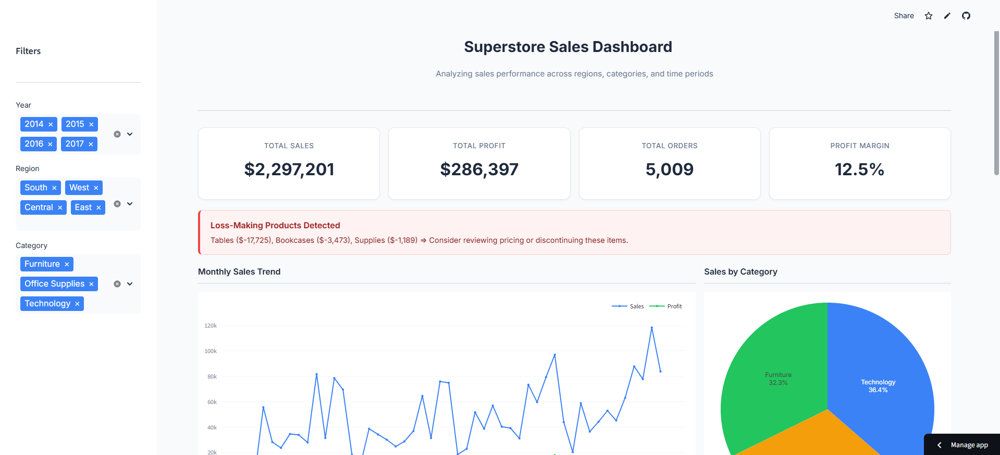

# Superstore Sales Dashboard

An interactive sales analytics dashboard built with Python and Streamlit, analyzing 4 years of retail transaction data to uncover actionable business insights.

## Preview



## Key Features

- **KPI Overview**: Total sales, profit, orders, and profit margin at a glance
- **Interactive Filters**: Filter by year, region, and product category
- **Trend Analysis**: Monthly sales and profit visualization
- **Regional Performance**: Compare sales across different regions
- **Product Insights**: Top 10 products by revenue
- **Segment Analysis**: Sales breakdown by customer segment
- **Loss Detection**: Automatic identification of loss-making product categories

## Key Insights from Analysis

| Finding              | Detail                               |
| -------------------- | ------------------------------------ |
| Total Revenue        | $2.3M across 4 years                 |
| Profit Margin        | 12.5% overall                        |
| Top Region           | West (32% of sales)                  |
| Top Category         | Technology ($836K)                   |
| Top Segment          | Consumer (52% of revenue)            |
| Loss-Making Products | Tables (-$17.7K), Bookcases (-$3.5K) |

## Tech Stack

- Python 3.x
- Streamlit
- Pandas
- Plotly

## Installation

1. Clone the repository

```bash
git clone https://github.com/damida16/superstore-sales-dashboard.git
cd superstore-sales-dashboard
```

2. Install dependencies

```bash
pip install -r requirements.txt
```

3. Run the dashboard

```bash
streamlit run app.py
```

4. Open browser at `http://localhost:8501`

## Project Structure

```
superstore-sales-dashboard/
├── app.py                    # Main dashboard application
├── requirements.txt          # Python dependencies
├── Sample_-_Superstore.csv   # Dataset
├── .streamlit/
│   └── config.toml           # Streamlit theme configuration
└── README.md
```

## Dataset

Sample Superstore dataset from Kaggle containing:

- 9,994 orders
- 4 years of data (2014-2017)
- 21 columns including sales, profit, region, category, etc.

## Author

**Damida Shu Mudita**  
Data Analyst & Automation Specialist

- LinkedIn: [linkedin.com/in/damidashumudita](https://linkedin.com/in/damidashumudita)
- GitHub: [github.com/damida16](https://github.com/damida16)
